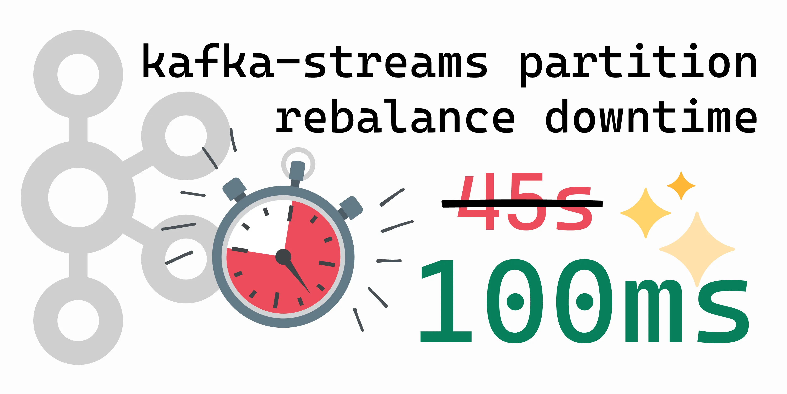

# kafka-streams-leave-group-on-close



Application + docker-compose setup that was put together for blog post   
https://thriving.dev/blog/reduce-rebalance-downtime-for-stateless-kafka-streams-apps

## Get Started

### build Quarkus modules

In a new terminal (1), from repository root, exec

```bash
cd dummy-producer && ./gradlew clean build
```

In a new terminal (2), from repository root, exec

```bash
cd kstreams-stateless-logger && ./gradlew clean build
```

### Start compose stack

In a new terminal (3), from repository root, run

```bash
docker-compose up --build -d
```

### Open Grafana Dashboard

Visit http://localhost:3030/ - signin with user+password `admin:admin`.

A basic dashboard with panels for replicas, consumer lag, message rate should show as the default board.

### Simulation: Re-create containers

Streams application logs, filtered by "REBALANCING"
```bash
docker logs -f kafka-streams-leave-group-on-close-kstreams-stateless-logger-1 |grep "REBALANCING"
```

Restart (Re-create) container `kafka-streams-leave-group-on-close-kstreams-stateless-logger-3` 
```bash
docker stop kafka-streams-leave-group-on-close-kstreams-stateless-logger-3 && sleep 15 && docker start kafka-streams-leave-group-on-close-kstreams-stateless-logger-3
```

### Change config for 'kstreams-stateless-logger'
`./kstreams-stateless-logger/src/main/resources/application.properties`

... re-build the module, re-build the container, re-apply docker-compose...
